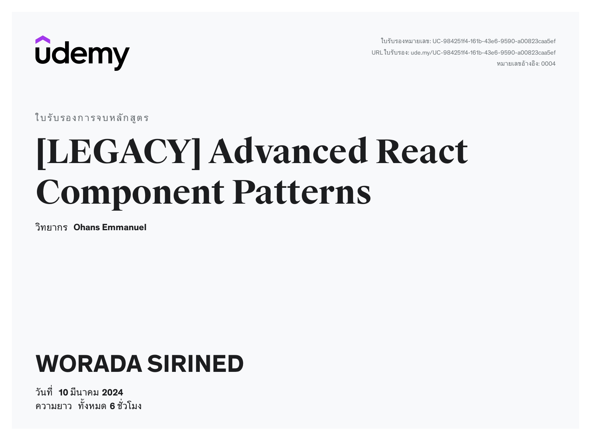

# Certificates

### [JavaScript Unit Testing - The Practical Guide](https://www.udemy.com/course/javascript-unit-testing-the-practical-guide/)

### [React Styled Components Course (V5)](https://www.udemy.com/course/styled-components-tutorial-and-project-course/?utm_campaign=email&utm_medium=email&utm_source=sendgrid.com)

### [GraphQL by Example](https://www.udemy.com/course/graphql-by-example/?utm_campaign=email&utm_medium=email&utm_source=sendgrid.com&couponCode=LEADERSALE24A)

### [[LEGACY] Advanced React Component Patterns](https://www.udemy.com/course/the-complete-guide-to-advanced-react-patterns/?utm_campaign=email&utm_medium=email&utm_source=sendgrid.com&couponCode=LEADERSALE24A)

### [The Complete Sass & SCSS Course: From Beginner to Advanced](https://www.udemy.com/course/sasscourse/?utm_campaign=email&utm_medium=email&utm_source=sendgrid.com)
